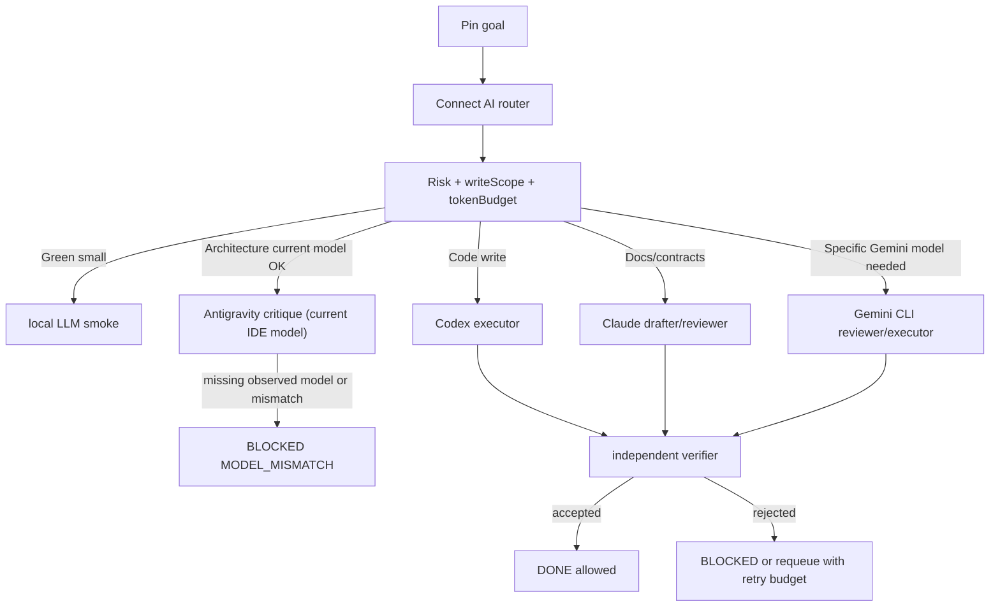

# Multi-Model Routing Design

Status: draft for human review
Scope: design only, no routing implementation in this slice

## Goal

Connect AI should act as the single command apex for Pin, then route work down a guarded pyramid:

`Pin -> Connect AI -> planner/classifier -> executor/reviewer/local smoke -> verifier -> durable memory`

The routing goal is not to use every model on every task. The goal is to spend high-context tokens only where they reduce risk, use cheap/local checks for small sanity work, and prevent any agent from claiming `DONE` before independent verification.

## Current Availability Snapshot

| Tier | Tool/model | Intended role | Current availability | Cost unit | Hard limits |
|---|---|---|---|---|---|
| T0 | local LLM | cheap classification, short sanity checks, smoke summaries | installed path exists but `connectAiLab.localLlmEnabled=false` by default | local compute / latency | no durable vault writes, no risky decisions |
| T1 | Codex | implementation, integration, tests, repo edits | ready | paid/cloud tokens and local tool time | must preserve dirty tree; must provide evidence |
| T1 | Claude | docs, contracts, instructions, secondary implementation review | ready | paid/cloud tokens | no direct vault writes; no approval authority |
| T2 | Gemini CLI | reviewer, architecture critique, future model-specific executor | sibling adapter in progress; confirmed model IDs documented | paid/cloud tokens | only use confirmed IDs; risky write forbidden |
| T2 | Antigravity `agy` | long-form architecture critique through the IDE/account current model | direct calls work, but model selection is not supported by `agy` | quota-bound cloud tokens | single current-model executor; must record observed model |
| T3 | Hermes | observer, coordinator candidate, long-running automation surface | ready but should remain constrained | external/local orchestration cost | cannot be approval source or loop driver for risky writes |
| T4 | CodeRabbit | diff review gate | authenticated but broad local review timed out | external review quota/time | evidence only when review returns |

## Routing Inputs

Every queue item must carry these fields before any worker receives it:

- `intent`: implementation, review, research, docs, smoke, audit, cleanup, decision
- `riskClass`: Green, Yellow, Red
- `writeScope`: exact paths or `read-only`
- `expectedTests`: commands or evidence required
- `rollbackPath`: command, backup path, or explicit `not-applicable`
- `tokenBudget`: small, medium, large, or explicit max
- `retryBudget`: default 1 for Green, 0 for Red, 2 only for known transient failures
- `approvalRequired`: true for risky write, credential, deploy, external send, destructive cleanup, root migration

## Decision Tree

```text
1. Is the task credential, deploy, destructive, account, payment, or external-send?
   -> Red: no model executes. Create human decision request.

2. Is the task durable vault writing?
   -> Route only through memory-bridge/vault-writer.
   -> Executor may prepare content, but writer enforces folder, frontmatter, links, duplicate checks.

3. Is the task read-only classification or short sanity checking?
   -> local LLM if enabled and input is non-secret.
   -> fallback Codex if local is disabled or output matters.

4. Is the task code implementation or integration?
   -> Codex primary executor.
   -> Claude can assist only if write scope is disjoint and contract is explicit.
   -> After executor: Gemini or Claude reviewer.

5. Is the task documentation, agent contract, instruction, or operating policy?
   -> Claude primary drafter or reviewer.
   -> Codex integrates into repo/vault through allowed writer.

6. Is the task architecture critique or long-plan review?
   -> Antigravity if the current IDE/account model is acceptable and transcript evidence records `observedModelLabel`.
   -> Gemini CLI when a specific Gemini model ID is required.
   -> Do not request Claude/Sonnet/Opus through `agy`; it cannot select models.

7. Is the task UI/runtime smoke?
   -> Browser/Chrome smoke if UI is involved.
   -> Codex records evidence; reviewer checks only if behavior is user-facing.

8. Is the task overnight automation?
   -> v1 read-only audit only.
   -> self-healing requires approved queue and Green risk.
```

## Task Type Mapping

| Task type | Primary | Secondary/reviewer | Local smoke | Notes |
|---|---|---|---|---|
| Simple classification | local LLM | Codex | optional | Only non-secret text; no write authority |
| Vault durable note | Codex prepares content | vault-writer enforces | vault health | No direct agent write |
| Repo bugfix | Codex | Claude or Gemini | focused tests | TDD when behavior changes |
| Agent contract | Claude | Codex | validate contracts | Human-readable output matters more than test count |
| Graph information architecture | Codex | Gemini critique if needed | vault health | Optimize cluster clarity, not linkless zero |
| Architecture critique | Antigravity current IDE model | Gemini CLI model-specific review | none | No code changes in critique phase |
| UI smoke | Codex | Browser/Chrome | webview smoke | Capture user-visible behavior |
| Queue retry planning | Codex | verifier | isolated temp queue | Block repeated failure after 2 loops |
| Nightly audit | automation runner | Codex summary | none | Read-only plus runtime report only |

## Fallback Graph



Fallback and model-truth rules:

- Antigravity `agy` does not support model selection. Treat it as the current IDE/account model only.
- Antigravity results must include `requestedModelLabel` and `observedModelLabel`; missing observed model or mismatch becomes `BLOCKED`.
- Gemini CLI is the model-specific path only for the current executable allowlist in `scripts/gemini-executor.js`: `gemini-2.5-flash`, `gemini-2.5-pro`, `gemini-3-pro-preview`. Do not route any other preview or stale ID until the executor contract, MCP schema, dispatcher, and tests are updated together.
- Natural-language goals that name a supported Gemini model, such as "Gemini 3 Pro" or `gemini-2.5-pro`, route to the Gemini executor and must not fall through to Antigravity.
- Natural-language goals that explicitly ask for cheap, local, quick, smoke, sanity, or zero-token classification route to `local-llm` unless they ask for a code change. This prevents small checks from spending Antigravity/Gemini quota.
- Gemini unavailable -> Claude reviewer for docs/contracts, Codex self-check only for low-risk implementation with explicit disclosure.
- local LLM disabled/unavailable -> Codex handles classification.
- CodeRabbit timeout -> exclude from evidence and continue with local tests/reviewer evidence.
- Browser/Chrome unavailable -> mark UI smoke as PARTIAL, never VERIFIED.

## Token Budget Policy

| Budget | Use for | Default model | Max behavior |
|---|---|---|---|
| small | classification, link grouping, smoke summaries | local LLM or Codex concise | no long context, no repo-wide scan |
| medium | single-file docs, small bugfix, focused review | Codex or Claude | include exact files and expected evidence |
| large | architecture critique, multi-file implementation, migration design | Codex + reviewer | split into slices before execution |

Budget rules:

- Start with the cheapest model that can safely answer, not the cheapest model overall.
- Do not send repo-wide context to Claude/Gemini/Antigravity when a focused file list is enough.
- Do not spend Antigravity quota attempting model selection; `agy` inherits the IDE/account current model.
- Use local LLM only for reversible, non-secret, non-authoritative work.
- Upgrade to Codex/Claude/Gemini when the result affects durable notes, queue state, repo code, user-facing behavior, or human trust.
- Any agent that consumes large context must output a compact handoff: files inspected, decision, evidence, unresolved risk.

## DONE And Verification Policy

Executor output status is `READY_FOR_VERIFICATION`, not `DONE`.

An item may become `DONE` only when:

1. changed files or affected notes are listed;
2. commands/evidence are current for this run;
3. required tests or review gates pass, or failures are explicitly recorded;
4. generated artifacts are classified or removed;
5. reviewer/verifier records an accept verdict.

For content-only slices, the proof is the content itself plus graph/link checks. Test counts are supporting evidence, not value proof.

## Phase Rollout

1. Phase A: Codex executor + one verifier.
2. Phase B: add Claude/Gemini reviewer and local smoke.
3. Phase C: 2-3 guarded workers, no more.
4. Phase D: nightly read-only audit and runtime reports.
5. Phase E: approved Green self-healing only.

Worker caps:

- default active workers: 2
- maximum active workers: 3
- same failure twice: circuit breaker
- Red task: human approval request only

## Open Questions Before S4 Prototype

- Which single route should be prototyped first: `Pin -> Connect AI -> Codex executor -> Gemini verifier`, or `Pin -> Connect AI -> Claude contract drafter -> Codex writer`?
- Should local LLM remain disabled by default until a non-secret classifier benchmark passes?
- Should Antigravity stay current-model reviewer-only while Gemini CLI becomes the model-specific route?
- What is the first project lane for live pyramid routing: Connect AI itself, job search, stock research, or YouTube?
